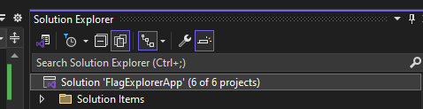

# Flag Explorer App

## Table of Contents
1. [Installation](#installation)
2. [Usage](#usage)

## Installation

### WebApi
To build and run the application locally:
install .NET 8 (https://dotnet.microsoft.com/en-us/download)
- Open bash, cmd, windows powershell
- cd [to your source folder]
- Run git clone https://github.com/hkunguma/FlagExplorerApp.git
- Open the solution using Visual Studio

#### Open solution Explorer 
- right click on Solution FlagExplorer, and select Restore Nuget Package
Or 
- open Package Manager Console and run Nuget restore (Tools -> Nuget Package Manager -> Package Manager Console)
  - Set Package source: nuget.org or location for your nuget packages is selected

#### Build
- right click on Solution FlagExplorer, and select Rebuild Solution

#### START Web API

- Click the triangle to start without debugging

- Trust ASP.NET Core SSL Certificate pop up, click yes

- Your connection isn't private

Run the following command to trust the development certificate:

 dotnet dev-certs https --trust

Restart your browser after trusting the certificate.

### Angular UI

Install Node.js (https://nodejs.org/en/download)

Open UI project using Visual Studio Code (FlagExplorerApp\ui\flag-explorer-webapp)

open a terminal

Install Angular CLI

Run: npm install -g @angular/cli

If you are having issues running this command check this link: https://angular.dev/tools/cli/setup-local#install-the-angular-cli

For example if you are using powershell you can run this command
- Set-ExecutionPolicy -Scope CurrentUser -ExecutionPolicy RemoteSigned

In terminal, switch to ui project folder
- cd */FlagExplorerApp/ui/flag-explorer-webapp

Start UI
- npm start

## Usage

Once the Angular UI is runnig in the browser:
- The Home screen should show a grid of countries and flags
- When you click a country flag: Country details should be displayed below the selected country row